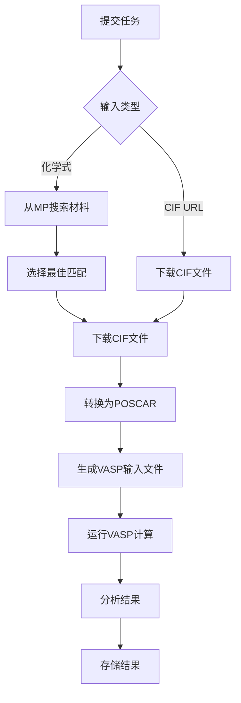

# VASP 结构优化 API 文档

## 概述

这是一个基于 FastAPI 的 VASP 结构优化计算服务，支持通过化学式或 CIF 文件 URL 提交结构优化任务，并提供完整的任务管理功能。

## 功能特性

- 🔬 **多种输入方式**: 支持化学式和 CIF URL 两种输入方式
- 📊 **Materials Project 集成**: 自动从 MP 数据库搜索和下载材料结构
- ⚡ **异步计算**: 基于任务队列的异步 VASP 计算
- 📈 **实时监控**: 实时任务状态和进度跟踪
- 🎯 **多种计算类型**: 支持 OXC、ORC、SSE、ECAT_OER、ECAT_HER 等计算类型
- 🔍 **高级筛选**: 支持空间群、带隙、原子数等多种筛选条件
- 📁 **结果管理**: 完整的计算结果存储和检索

## API 端点

### 1. 提交结构优化任务

**POST** `/vasp/structure-optimization`

#### 请求参数

```json
{
  "user_id": "string",                    // 必填：用户ID
  "formula": "string",                    // 可选：化学式（与cif_url二选一）
  "cif_url": "string",                   // 可选：CIF文件URL（与formula二选一）
  "calc_type": "OXC|ORC|SSE|ECAT_OER|ECAT_HER", // 必填：计算类型
  
  // 以下参数仅在使用formula时有效
  "spacegroup": "string",                // 可选：空间群符号
  "max_energy_above_hull": 0.1,         // 可选：最大能量上凸包距离
  "min_band_gap": 2.0,                  // 可选：最小带隙
  "max_band_gap": 5.0,                  // 可选：最大带隙
  "max_nsites": 50,                     // 可选：最大原子数
  "min_nsites": 1,                      // 可选：最小原子数
  "stable_only": true,                  // 可选：只选择稳定材料
  "selection_mode": "auto|stable|most_stable|first", // 可选：选择模式
  "kpoint_density": 30.0                // 可选：K点密度参数
}
```

#### 响应

```json
{
  "task_id": "string",
  "status": "queued",
  "message": "结构优化任务已提交，任务ID: xxx"
}
```

### 2. 查询任务状态

**GET** `/vasp/task/{task_id}?user_id={user_id}`

#### 响应

```json
{
  "task_id": "string",
  "user_id": "string",
  "task_type": "structure_optimization",
  "status": "queued|running|completed|failed|canceled",
  "progress": 75,
  "params": {},
  "result_path": "string",
  "error_message": "string",
  "created_at": "2024-01-01T00:00:00",
  "updated_at": "2024-01-01T00:00:00"
}
```

### 3. 取消任务

**POST** `/vasp/task/{task_id}/cancel?user_id={user_id}`

### 4. 列出用户任务

**GET** `/vasp/tasks?user_id={user_id}`

### 5. 获取任务结果

**GET** `/vasp/task/{task_id}/result?user_id={user_id}`

## 计算类型说明

| 类型 | 描述 | 适用场景 |
|------|------|----------|
| OXC | 氧化物/硫化物固体电解质 | 固体电池材料 |
| SSE | 固体电解质（等同OXC） | 固体电池材料 |
| ORC | 氧化物还原催化剂 | 催化材料研究 |
| ECAT_OER | 氧析出反应催化剂 | 电解水制氢 |
| ECAT_HER | 氢析出反应催化剂 | 电解水制氢 |

## 工作流程



## 使用示例

### Python 客户端

```python
import requests
import time

class VaspAPIClient:
    def __init__(self, base_url="http://localhost:8000"):
        self.base_url = base_url
    
    def submit_optimization(self, user_id, formula, calc_type="OXC", **kwargs):
        data = {
            "user_id": user_id,
            "formula": formula,
            "calc_type": calc_type,
            **kwargs
        }
        response = requests.post(f"{self.base_url}/vasp/structure-optimization", json=data)
        return response.json()
    
    def get_status(self, task_id, user_id):
        response = requests.get(f"{self.base_url}/vasp/task/{task_id}", params={"user_id": user_id})
        return response.json()

# 使用示例
client = VaspAPIClient()

# 提交LiFePO4优化任务
response = client.submit_optimization(
    user_id="user001",
    formula="LiFePO4",
    calc_type="OXC",
    stable_only=True,
    max_energy_above_hull=0.1
)

task_id = response['task_id']
print(f"任务ID: {task_id}")

# 监控任务状态
while True:
    status = client.get_status(task_id, "user001")
    print(f"状态: {status['status']}, 进度: {status['progress']}%")
    
    if status['status'] in ['completed', 'failed', 'canceled']:
        break
    
    time.sleep(30)
```

### curl 命令

```bash
# 提交任务
curl -X POST "http://localhost:8000/vasp/structure-optimization" \
     -H "Content-Type: application/json" \
     -d '{
       "user_id": "user001",
       "formula": "LiFePO4",
       "calc_type": "OXC",
       "stable_only": true,
       "max_energy_above_hull": 0.1
     }'

# 查询状态
curl "http://localhost:8000/vasp/task/{task_id}?user_id=user001"

# 取消任务
curl -X POST "http://localhost:8000/vasp/task/{task_id}/cancel?user_id=user001"
```

## 部署指南

### 环境要求

- Python 3.8+
- VASP 软件包
- cif2cell 工具
- Materials Project API 密钥

### 安装步骤

1. **安装依赖**
```bash
pip install -r requirements.txt
```

2. **配置环境**
```python
# 修改 src/vasp_server/Config.py
VASP_PATH = "/path/to/vasp/bin/vasp_std"
PSEUDO_PATH = "/path/to/pseudopotentials"
MP_API_KEY = "your_mp_api_key"
```

3. **初始化数据库**
```bash
python -c "from src.vasp_server.task_manager.database import init_db; init_db()"
```

4. **启动服务**
```bash
python -m src.vasp_server.vasp_server_api
```

### 集群配置

#### SLURM 系统
```bash
# 修改 src/vasp_server/vasp_worker.py 中的作业脚本模板
#SBATCH -N 2
#SBATCH -n 56
#SBATCH --ntasks-per-node=28
#SBATCH --partition=normal3
```

#### LSF 系统
```bash
# 修改作业提交命令
bsub < vasp_job.lsf
```

## 监控和日志

### 任务状态
- `queued`: 任务已提交，等待执行
- `running`: 任务正在执行
- `completed`: 任务成功完成
- `failed`: 任务执行失败
- `canceled`: 任务已取消

### 进度跟踪
- 5%: 开始处理输入参数
- 10-20%: 下载CIF文件
- 25%: 转换为POSCAR
- 40%: 生成VASP输入文件
- 50-90%: VASP计算进行中
- 95%: 分析计算结果
- 100%: 计算完成

### 日志文件
- API日志: `logs/api.log`
- 任务日志: `{work_dir}/result.log`
- VASP输出: `{work_dir}/OUTCAR`

## 故障排除

### 常见问题

1. **任务提交失败**
   - 检查输入参数格式
   - 确认Materials Project API密钥有效
   - 验证网络连接

2. **VASP计算失败**
   - 检查VASP路径配置
   - 确认赝势文件存在
   - 查看工作目录中的错误日志

3. **任务长时间停留在队列中**
   - 检查计算资源是否可用
   - 确认作业调度系统正常工作

4. **结果文件缺失**
   - 检查工作目录权限
   - 确认计算成功完成
   - 查看任务状态信息

### 性能优化

1. **计算资源**
   - 根据材料大小调整节点数和核心数
   - 优化K点密度参数
   - 使用适当的截断能

2. **存储管理**
   - 定期清理已完成任务的工作目录
   - 压缩长期存储的结果文件
   - 监控磁盘空间使用

3. **网络优化**
   - 使用本地材料数据库缓存
   - 优化CIF文件下载并发数
   - 配置合适的超时时间

## API 版本历史

### v1.0.0 (当前版本)
- 基础结构优化功能
- Materials Project集成
- 任务管理系统
- 多种计算类型支持

### 计划功能
- [ ] 态密度计算支持
- [ ] 分子动力学模拟
- [ ] 批量任务处理
- [ ] 结果可视化接口
- [ ] 用户认证系统

## 联系支持

如有问题或建议，请通过以下方式联系：

- 邮箱: support@example.com
- 文档: https://docs.example.com
- GitHub: https://github.com/example/vasp-api

---

*最后更新: 2024年1月* 